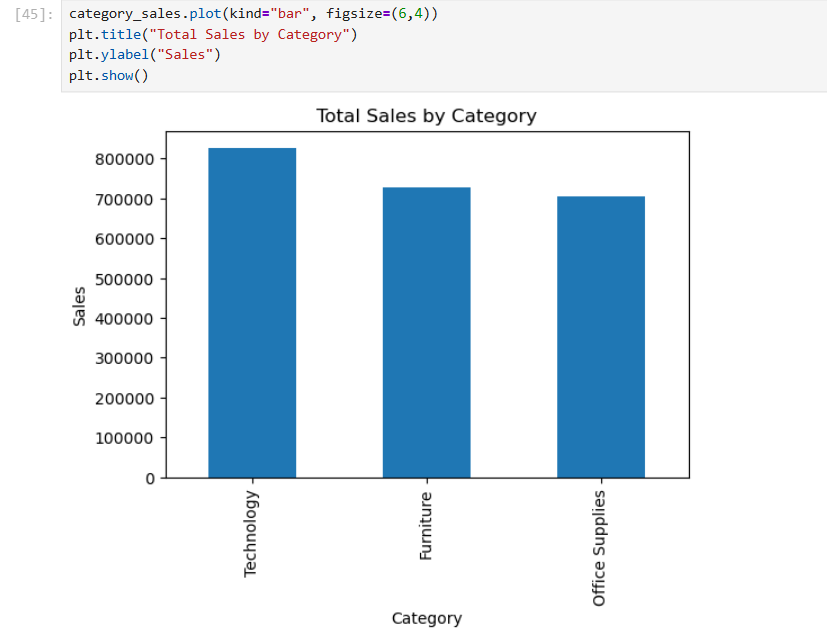
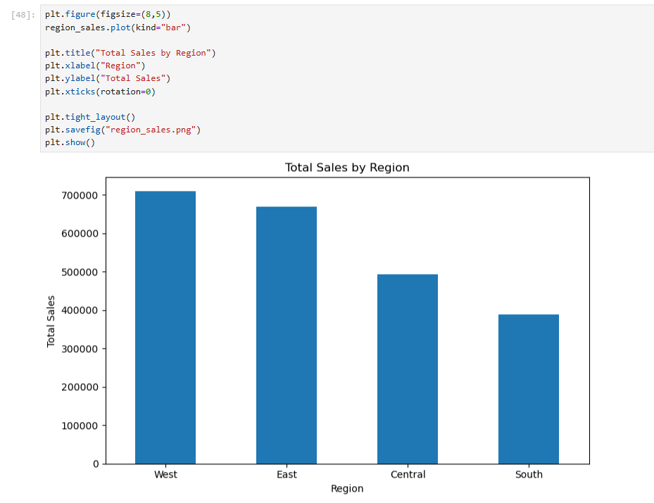
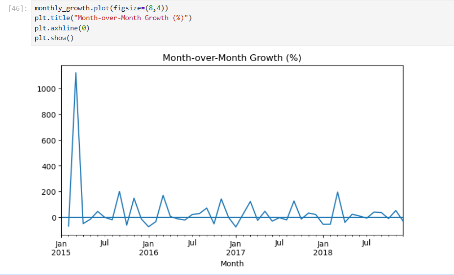

# E-Commerce Sales Analysis – Python

## Project Objective
Analyze sales performance, customer distribution, and monthly revenue trends using Python.

## Tools Used
- Python
- Pandas
- NumPy
- Matplotlib
- Seaborn

## Key Insights
- Technology category generates the highest revenue.
- Revenue is diversified across customers (Top 10 contribute ~6.8%).
- West region leads in total sales.
- Central region shows higher shipping delays.
- Monthly growth fluctuates and is mostly negative.

---

## Visual Insights

### 1. Sales by Category

### 2. Sales by Region

### 3. Month-over-Month Growth

